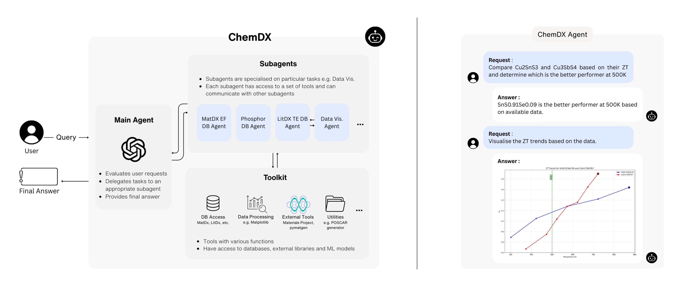

## KRICT ChemDX Hackathon 2025

ChemDX Agentic AI is developed for KRICT ChemDX Hackathon 2025.



# ChemDX Agentic AI

**Main Goal**

- Develop **Agentic AI** to leverage the ChemDX database
- Solve problems efficiently and accurately through a **multi-agent system** and a **working-memory** system
- Build a system that can answer diverse user queries by integrating multiple tools
- Create an Agentic AI capable of handling **three challenging questions** (for each participant)

**Authors**

- Yeonghun Kang
- Anastasia Arkhipenkova
- Bogeun Park
- SeungPyo Kang


## Structure of ChemDX Agentic AI

- The ChemDX Agentic AI consists of **1 Main Agent, 14 Sub-Agents, and 24 Tools**.
- Each Sub-Agent is connected either to the Main Agent or to other Sub-Agents, enabling flexible collaboration.
- The **Main Agent** manages the Sub-Agents, decomposing a problem into smaller, specific tasks and creating the optimal plan to solve them.
- Each **Sub-Agent** is assigned a specialized role, leveraging various tools or communicating with other Sub-Agents to accomplish its specific tasks.

<div style="text-align : center;"></div>


## How does ChemDX Agent work?

### 1. Prompt Engineering

- **Prompt engineering** refers to the technique of guiding AI models to produce desired outputs by modifying the input prompt, without changing the model’s weights.
- Each **Sub-Agent** is initialized with a system prompt that defines its *name, role,* and *context*, which determine its specialized behavior.
- The **User Prompt** provides the main goal and the current task, and leverages the accumulated working memory to solve problems efficiently.


### 2. Multi-agent system and Working memory

- The **Main Agent** decomposes the main task into smaller tasks and assigns each to the appropriate Sub-Agent.
- Each **Sub-Agent** may invoke tools to solve its task and, when necessary, can also collaborate with other Sub-Agents.
- The outputs of Sub-Agents are stored in the **Working Memory**, which is then reused by subsequent Sub-Agents to improve efficiency.
- Finally, the **Main Agent** produces the final answer and performs a self-evaluation to ensure the task has been solved correctly.


## How to install

```bash
$ git clone https://github.com/Yeonghun1675/ChemDX_agentic_AI.git
$ cd ChemDX_agentic_AI
$ pip install -e .
```


## How to use it

```bash
$ streamlit run app.py
```


## Example of ChemDX agent

### Example 1

Quesstion

| Does the MatDX EF database contain polymorphs? If so, provide one example along with their polymorphic structures. Among them, identify the most stable structure (i.e., the one with the lowest formation energy) and export it as a POSCAR file based on MatDX EF database. |
| ------------------------------------------------------------ |

Final Answer 

| The MatDX EF database contains polymorphs. For example, "Ag4Al4" has 7 polymorphic structures with different spacegroups: C2/m, Cccm, I4/mmm, P1, P4/nmm, and Pmm2. The most stable structure is the one with space group C2/m, having the lowest formation energy of -0.0533 eV/atom. The POSCAR file for this stsructure has been generated and is available for download. |
| ------------------------------------------------------------ |

Evaluation

```markdown
The task was executed successfully. The database was checked for polymorphs, an example was provided, the most stable structure was identified, and the POSCAR file was generated and made available for download.
```

Procedure


### Example 2

Question

```markdown
- Please recommend blue phosphor candidates that meet the conditions of Emission max ∈ [360, 420], Decay time ≤ 100, and QE ≥ 80. Please tell me the properties of the recommended materials.
- Next, please summarize the Eu co-doping concentration change in the Ba2Bi0.95V3O11 family of emission max and color change. 
- Finally, please summarize the correlation/trend of Emission vs color.
```

Final Answer

```mark
1. Blue Phosphor Candidates:
- RbCaGdP2O8: Ce doped at 0.1 concentration, Emission max: 408 nm, Decay time: 45 ns, QE: 83%
- Ba2Y1.8P2O12Si: Ce doped at 0.14 concentration, Emission max: 409 nm, Decay time: 42 ns,
QE: 84%
- KSrGdP208: Ce doped at 0.04 concentration, Emission max: 370 nm, Decay time: 63 ns, QE:
96%
- KSrGdP208: Ce doped at 0.04 concentration, Emission max: 370 nm, Decay time: 47 ns, QE:
90%
- KNaCa2P208Na0.04: Ce doped at 0.04 concentration, Emission max: 367 nm, Decay time: 47 ns, QE: 89%
2. Eu Co-doping in Ba2Bi0.95V3011:
• The emission maximum remains stable at 619 nm across varying Eu concentrations, with the color consistently red, indicating no significant shift in emission or chromaticity with changes in Eu concentration.
3. Correlation/Trend of Emission vs Color:
• There is a strong positive correlation between Emission max and the CIE x coordinate, indicating a shift towards the red end of the spectrum as the emission wavelength increases.
The correlation with the CIE y coordinate is weak, suggesting less consistent effects on the vertical position in the ClE color space.
```


Procedure

