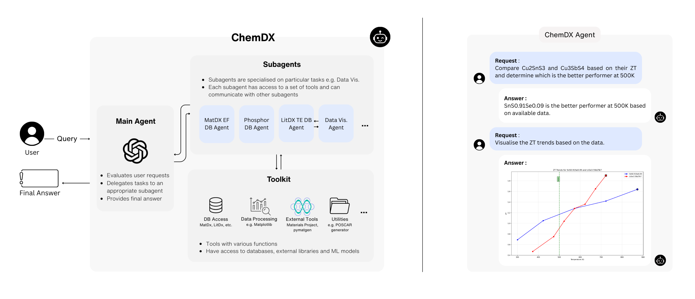
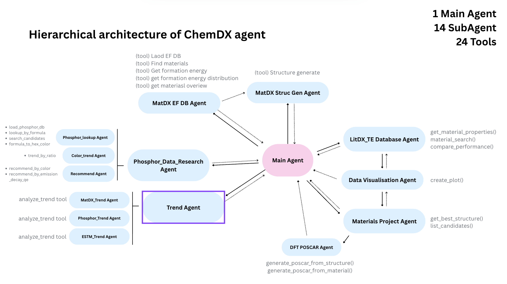
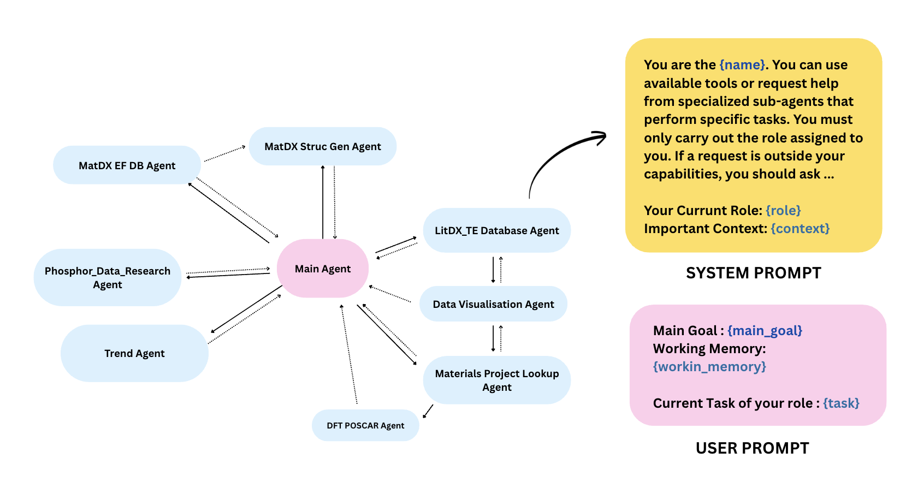
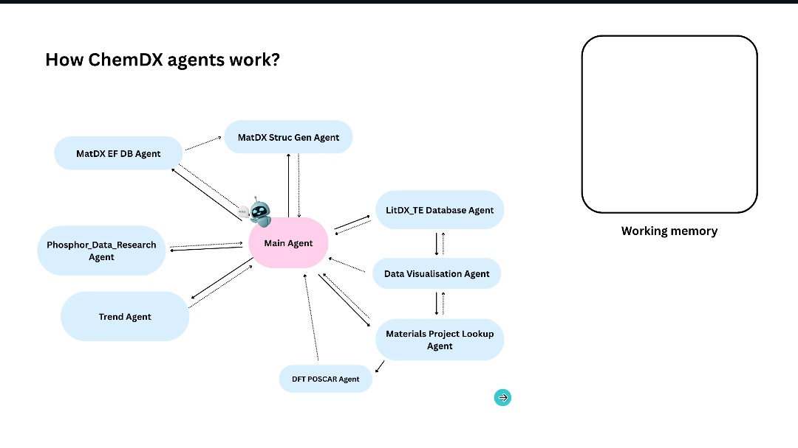
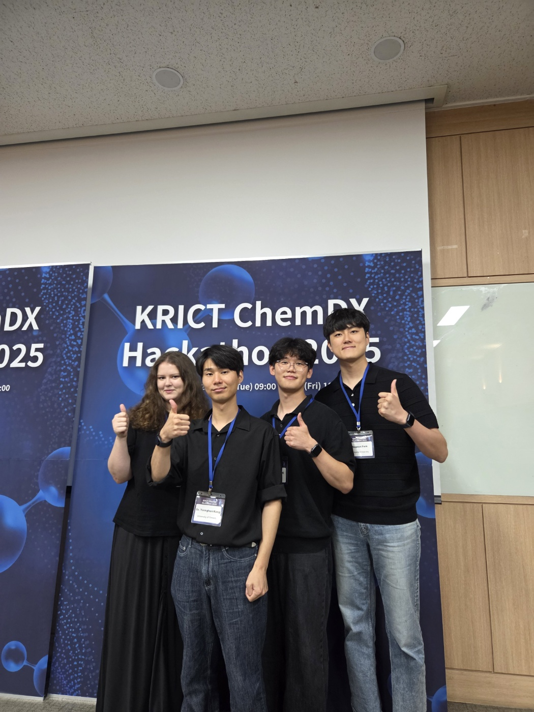

## KRICT ChemDX Hackathon 2025

ChemDX Agentic AI is developed for KRICT ChemDX Hackathon 2025.

# ChemDX Agentic AI



## Overview

ChemDX Agentic AI is a modular, agent-based artificial intelligence framework developed for the KRICT ChemDX Hackathon 2025, designed to support data-driven materials research. The project demonstrates how multiple specialized agents, each connected to verious ChemDX databases (MatDX EF, LitDX_TE, and Phosphor DB) and tools, can be orchestrated to answer complex materials science questions that span materials discovery, structure generation, electronic structure preparation, trend analysis, and visualization.

Rather than relying on a single monolithic model, ChemDX Agentic AI decomposes materials-related queries into structured subtasks handled by dedicated agents. This agentic design enables seamless integration of experimental databases, computational materials data, visualization tools, and first-principles inputs, allowing the system to flexibly address heterogeneous materials science problems within a unified workflow.


## Key Methods and Approaches
ChemDX Agentic AI is built on prompt engineering to control agent behavior without modifying model weights. Each Sub-Agent is initialized with a structured system prompt that defines its role and context, while the user prompt specifies the overall goal and task. A shared working memory is used to accumulate intermediate results, allowing subsequent agents to reuse prior information and perform tasks more efficiently.

The framework adopts a multi-agent architecture in which a Main Agent decomposes the task and assigns subtasks to ChemDX-specific Sub-Agents and tools, including database retrieval, structure generation, trend analysis, visualization, and DFT input generation. Sub-Agent outputs are integrated by the Main Agent to produce the final response, enabling flexible and coherent problem solving across diverse materials science workflows.


## Key Results and Contributions

During the Hackathon, ChemDX Agentic AI demonstrated its effectiveness by successfully addressing three conceptually distinct materials science problems using a unified agentic workflow. Despite differences in data type, target properties, and analytical depth, all problems were solved by dynamically orchestrating multiple specialized agents and external tools within a single framework, highlighting the flexibility and generality of the proposed approach.

Across these tasks, the system combined database-driven materials retrieval, quantitative comparison, trend analysis, visualization, and structure generation without manual intervention. Sub-agents were selectively activated depending on the problem context, allowing the framework to adaptively integrate phosphor databases, thermoelectric literature data, plotting tools, and DFT input generation pipelines. This demonstrated that heterogeneous materials research questions can be handled coherently through agent-level task decomposition rather than task-specific pipelines.

Overall, the results illustrate that ChemDX Agentic AI provides a practical and extensible solution for solving diverse materials science problems through coordinated sub-agent collaboration. The project highlights how agent-based AI systems can unify materials databases, analytical tools, and computational workflows, offering a scalable foundation for AI-assisted materials discovery and evaluation.


## Main Goal

- Develop **Agentic AI** to leverage the ChemDX database
- Solve problems efficiently and accurately through a **multi-agent system** and a **working-memory** system
- Build a system that can answer diverse user queries by integrating multiple tools
- Create an Agentic AI capable of handling **three challenging questions** (for each participant)


## Structure of ChemDX Agentic AI

- The ChemDX Agentic AI consists of **1 Main Agent, 14 Sub-Agents, and 24 Tools**.
- Each Sub-Agent is connected either to the Main Agent or to other Sub-Agents, enabling flexible collaboration.
- The **Main Agent** manages the Sub-Agents, decomposing a problem into smaller, specific tasks and creating the optimal plan to solve them.
- Each **Sub-Agent** is assigned a specialized role, leveraging various tools or communicating with other Sub-Agents to accomplish its specific tasks.

<div style="text-align : center;"></div>


## How does ChemDX Agent work?

### 1. Prompt Engineering

- **Prompt engineering** refers to the technique of guiding AI models to produce desired outputs by modifying the input prompt, without changing the model’s weights.
- Each **Sub-Agent** is initialized with a system prompt that defines its *name, role,* and *context*, which determine its specialized behavior.
- The **User Prompt** provides the main goal and the current task, and leverages the accumulated working memory to solve problems efficiently.



### 2. Multi-agent system and Working memory

- The **Main Agent** decomposes the main task into smaller tasks and assigns each to the appropriate Sub-Agent.
- Each **Sub-Agent** may invoke tools to solve its task and, when necessary, can also collaborate with other Sub-Agents.
- The outputs of Sub-Agents are stored in the **Working Memory**, which is then reused by subsequent Sub-Agents to improve efficiency.
- Finally, the **Main Agent** produces the final answer and performs a self-evaluation to ensure the task has been solved correctly.




## How to install

```bash
$ git clone https://github.com/Yeonghun1675/ChemDX_agentic_AI.git
$ cd ChemDX_agentic_AI
$ pip install -e .
```


## How to use it

```bash
$ streamlit run app.py
```


## Example of ChemDX agent

### Example 1

Question

```mark
Compare Cu2SnS3 and Cu3SbS4 based on their ZT and determine which is the better performer at 500K.  Compare and plot the ZT trends using matplotlib. For the best performing material generate a POSCAR file.
```

Final Answer

```mark
The ZT values for Cu2SnS3 and CuSbS were compared as a function of temperature. Cu3SbS4 was found to be the better performer at 500K with a ZT of 0.05, compared to Cu2SnS3's ZT of 0.01. A POSCAR file has been generated for Cu3SbS4 and is available for download.
```

Evaluation

```mark
The task was executed successfully. The ZT values were compared, the better performing material at 500K was identified, and the POSCAR file for Cu3SbS4 was generated as requested.
```

Procedure


### Example 2

Question

```markdown
- Please recommend blue phosphor candidates that meet the conditions of Emission max ∈ [360, 420], Decay time ≤ 100, and QE ≥ 80. Please tell me the properties of the recommended materials.
- Next, please summarize the Eu co-doping concentration change in the Ba2Bi0.95V3O11 family of emission max and color change. 
- Finally, please summarize the correlation/trend of Emission vs color.
```

Final Answer

```mark
1. Blue Phosphor Candidates:
- RbCaGdP2O8: Ce doped at 0.1 concentration, Emission max: 408 nm, Decay time: 45 ns, QE: 83%
- Ba2Y1.8P2O12Si: Ce doped at 0.14 concentration, Emission max: 409 nm, Decay time: 42 ns,
QE: 84%
- KSrGdP208: Ce doped at 0.04 concentration, Emission max: 370 nm, Decay time: 63 ns, QE:
96%
- KSrGdP208: Ce doped at 0.04 concentration, Emission max: 370 nm, Decay time: 47 ns, QE:
90%
- KNaCa2P208Na0.04: Ce doped at 0.04 concentration, Emission max: 367 nm, Decay time: 47 ns, QE: 89%
2. Eu Co-doping in Ba2Bi0.95V3011:
- The emission maximum remains stable at 619 nm across varying Eu concentrations, with the color consistently red, indicating no significant shift in emission or chromaticity with changes in Eu concentration.
3. Correlation/Trend of Emission vs Color:
- There is a strong positive correlation between Emission max and the CIE x coordinate, indicating a shift towards the red end of the spectrum as the emission wavelength increases.
The correlation with the CIE y coordinate is weak, suggesting less consistent effects on the vertical position in the ClE color space.
```

Evaluation

```markdown
The task was executed well, providing detailed information on blue phosphor candidates, the effect of Eu co-doping in Ba2Bi0.95V3011, and the correlation between emission and color. The results are coherent and meet the specified conditions.
```

Procedure


### Example 3

Quesstion

```markdown
Does the MatDX EF database contain polymorphs? If so, provide one example along with their polymorphic structures. Among them, identify the most stable structure (i.e., the one with the lowest formation energy) and export it as a POSCAR file based on MatDX EF database.
```

Final Answer 

```mark
The MatDX EF database contains polymorphs. For example, "Ag4Al4" has 7 polymorphic structures with different spacegroups: C2/m, Cccm, I4/mmm, P1, P4/nmm, and Pmm2. The most stable structure is the one with space group C2/m, having the lowest formation energy of -0.0533 eV/atom. The POSCAR file for this stsructure has been generated and is available for download.
```

Evaluation

```markdown
The task was executed successfully. The database was checked for polymorphs, an example was provided, the most stable structure was identified, and the POSCAR file was generated and made available for download.
```

Procedure


## Reproducibility and Limitations

System performance depends on the underlying language models and prompt configurations. While the architecture improves reasoning structure, outputs may vary across models and settings. The current version focuses on reasoning and safety support rather than quantitative prediction.

**Authors**



- Yeonghun Kang (Team leader, Development architecture of Agentic AI framework)
- Anastasia Arkhipenkova (Development of subagents and tools, Run example 1)
- Bogeun Park (Development of subagents and tools, Run example 2)
- SeungPyo Kang (Development of subagents and tools, Run example 3)
