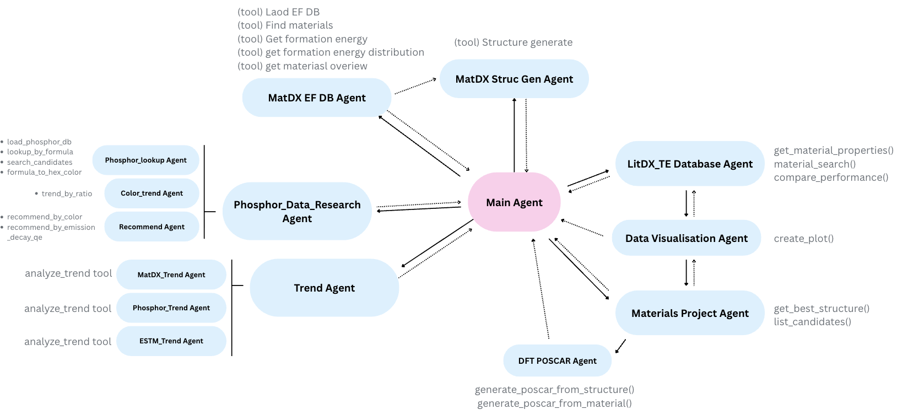
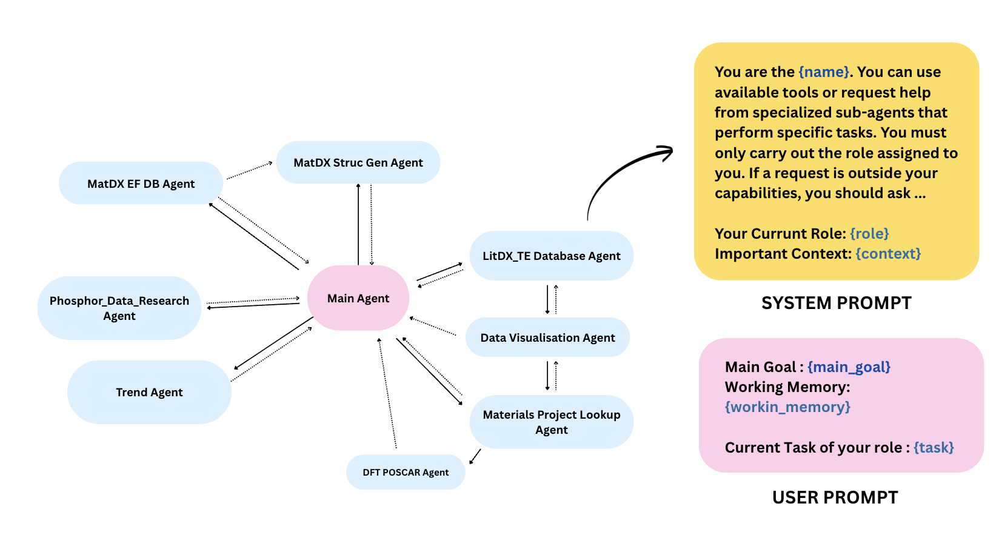
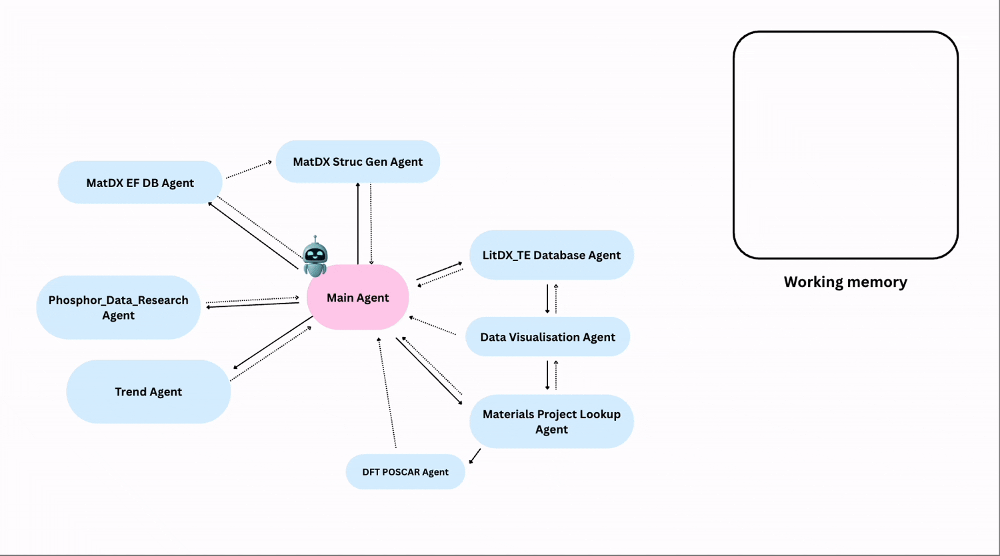

## KRICT ChemDX Hackathon 2025

# ChemDX Agentic AI

- ChemDX Agentic AI is developed for KRICT ChemDX Hackathon 2025.
- ChemDX Agent is multi-agent system for ChemDX database.


## Structure of ChemDX Agentic AI




## How does ChemDX Agent work?

### 1. Prompt Engineering



### 2. Multi-agent system and Working memory




## How to install

```bash
$ git clone https://github.com/Yeonghun1675/ChemDX_agentic_AI.git
$ cd ChemDX_agentic_AI
$ pip install -e .
```


## How to use it

```bash
$ streamlit run app.py
```


## Example of ChemDX agent

